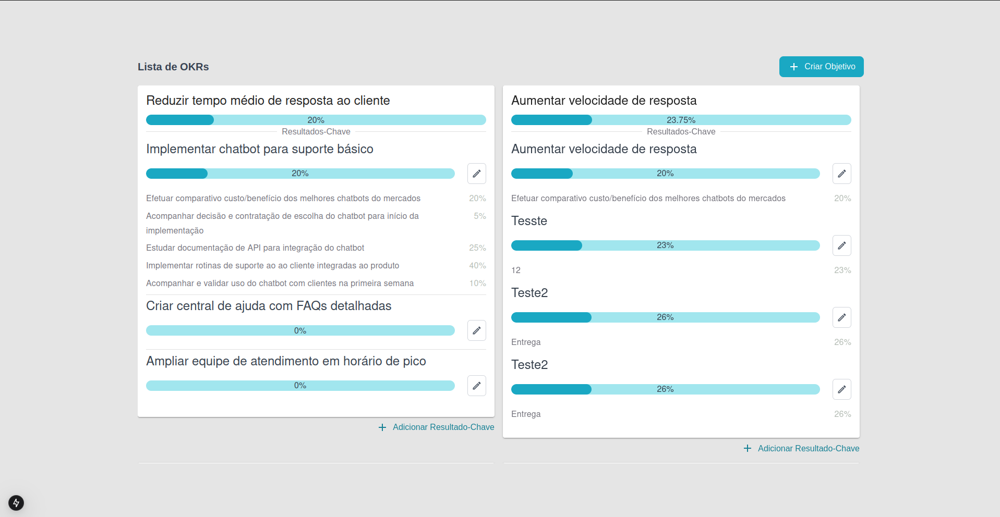
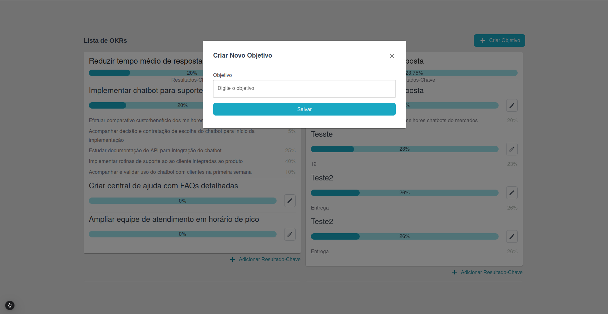
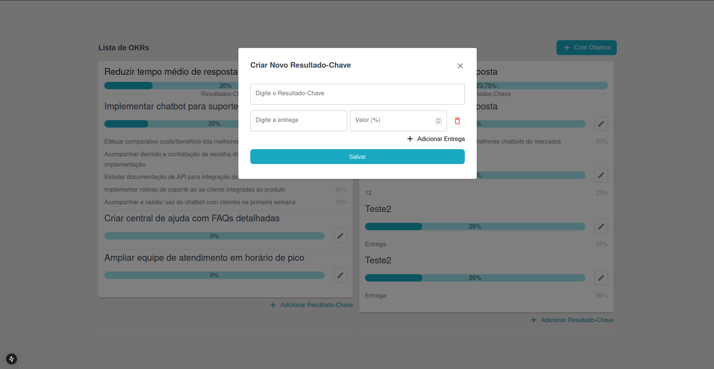
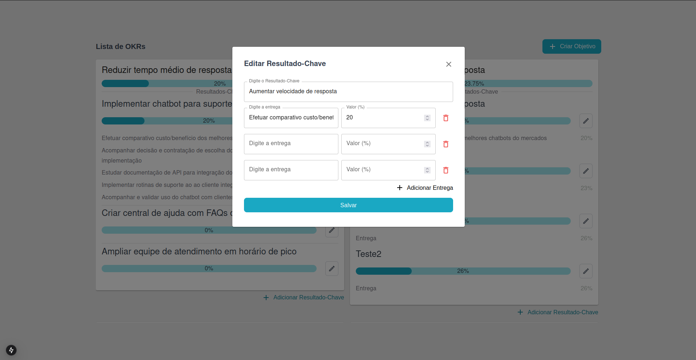

## Visão Geral

Esse projeto foi feito em Next JS.

Usei o seguinte comando para rodar localmente:

```bash
yarn dev
```

Para instalar as dependências, use
```bash
yarn install
#ou
npm install
```

O projeto está disponível no github:
https://github.com/gabriel-bassani/TesteTTZ

E também está disponível no ar, através do Vercel em:
https://teste-ttz-gabrielbassanis-projects.vercel.app/

Utilizei a API Rest criada pelos criadores do teste:
https://67a67e77510789ef0dfb8c44.mockapi.io/api/okrs

Fiz testes básicos Jest de interação com a tela, devido a falta de tempo livre que eu tive essa semana para fazer o teste, se eu estivesse menos ocupado teria feito mais. Executei o seguinte comando para realizar eles:

```bash
yarn jest
```

## Imagens

Caso não seja possível acessar o projeto no ar através do link do Vercel, ou rodando localmente, aqui estão algumas mensagens tiradas nos últimos momentos antes do meu envio.




